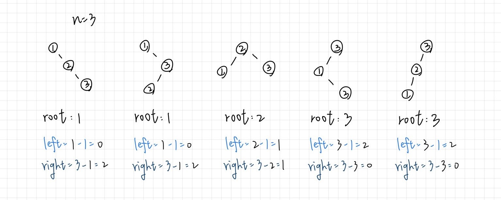

## classification: dynamic programming

## key insight
1. Optimal Substructure
  - root choice partitions the problem
  - left subtree will have `j - 1` nodes
  - right subtree will have `i - j` nodes 

2. `dp` State Definition:

represents the max number of structurally unique BST's which have exactly `n` nodes

3. Initialization (Base cases) : 
  - `dp[0] = 1;`
  - `dp[1] = 1;`

4. Bottom-up Approach
  - build from smaller integers to large ones

## example

