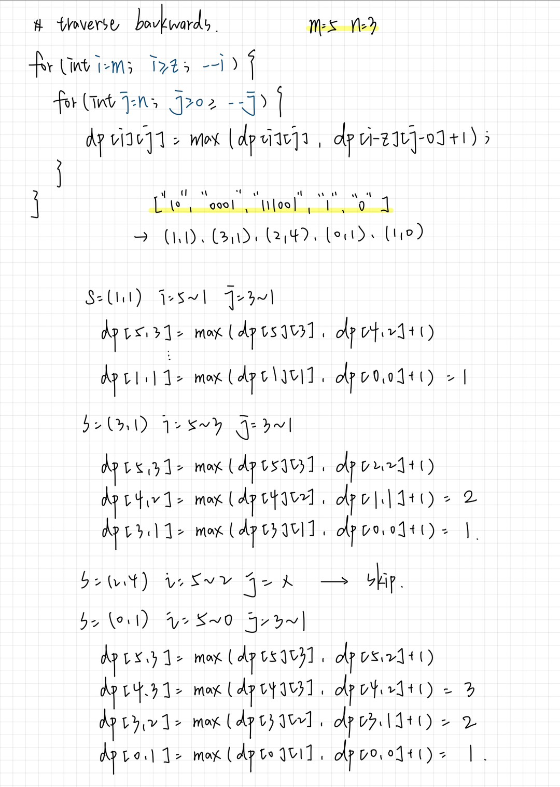

## classification: dynamic programming

## key insight
1. DP Definition: `dp[i][j]` -> max number of strings we can form with at most i zeros and j ones

```cpp
// declaration
vector<vector<int>> dp(m + 1, vector<int>(n + 1, 0));
```

2. State Transition: `dp[i][j] = max(dp[i][j], dp[i - z][j - o] + 1)`
  - let `z` = number of zeros in the string 
  - let `o` - number of ones in the string

3. Iteration Order: backward

```cpp
// traverse backwards
for (int i = m; i >= z; --i) {
  for (int j = n; j >= o; --j) {
    dp[i][j] = max(dp[i][j], dp[i - z][j - o] + 1);
  }
}
```

4. Final Answer: `dp[m][n]`

## example
